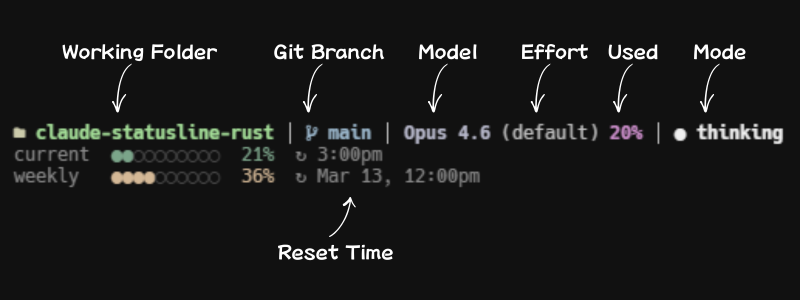

# claude-statusline-rs

A fast, segment-based statusline for Claude Code, written in Rust.



## Install

### One-line install

**macOS / Linux / Git Bash:**
```bash
curl -fsSL https://raw.githubusercontent.com/rainday/claude-statusline-rust/main/install.sh | bash
```

**Windows (PowerShell):** open Git Bash first, then run the command above. Or:
```powershell
& "C:\Program Files\Git\bin\bash.exe" -c "curl -fsSL https://raw.githubusercontent.com/rainday/claude-statusline-rust/main/install.sh | bash"
```

### cargo install

```bash
cargo install claude-statusline-rs
```

Then manually add to `~/.claude/settings.json`:

```json
{
  "statusLine": {
    "type": "command",
    "command": "claude-statusline-rs"
  }
}
```

### Install from Claude Code

In your Claude Code session, just ask:

> Install claude-statusline-rs by running: `curl -fsSL https://raw.githubusercontent.com/rainday/claude-statusline-rust/main/install.sh | bash`

## Uninstall

```bash
curl -fsSL https://raw.githubusercontent.com/rainday/claude-statusline-rust/main/install.sh | bash -s uninstall
```

Or from Claude Code, ask:

> Uninstall claude-statusline-rs by running: `curl -fsSL https://raw.githubusercontent.com/rainday/claude-statusline-rust/main/install.sh | bash -s uninstall`

## Display

```
📁 project │ 🌿 main* │ 🤖 Opus 4.6 │ ✍️ 32% │ ● thinking │ ◑ high
current  ●●●○○○○○○○  28%  ↻ 7:00pm
weekly   ●●●●●●●●○○  79%  ↻ mar 10, 10:00am
🔄 2 tasks (1 in_progress, 1 pending)
```

### Segments

| Segment | Description |
|---------|-------------|
| Directory | Current folder name |
| Git | Branch + dirty indicator, worktree name (`⎇name`) in linked worktrees, and dev server port (`:PORT`) from a `.dev-port` file at the repo root |
| Model | Current Claude model |
| Context Window | Token usage % (color-coded) |
| Thinking | Green dot when thinking, gray when not |
| Effort | Effort level from settings |
| Usage | 5-hour and 7-day rate limit bars (OAuth API) |
| Tasks | Active background tasks from `~/.claude/tasks/` |

### Colors (Morandi Palette)

Muted, sophisticated tones: dusty blue, sage green, warm sand, amber, dusty rose, mauve.

## Configure

Edit `~/.claude/statusline-rs/config.toml`:

```toml
[general]
separator = " │ "

[segments]
enabled = ["directory", "git", "model", "context_window", "thinking", "effort", "usage", "tasks"]

[git]
show_worktree = true   # append ⎇<name> when inside a linked git worktree
port_file = ".dev-port" # file read from repo root to show a dev server port; "" disables

[theme]
name = "morandi"

[usage]
cache_ttl_secs = 60
```

### Dev server port

To show a running backend's port, have your dev script write it to `.dev-port` at the repo/worktree root:

```json
"dev": "echo $PORT > .dev-port && vite --port $PORT"
```

Add `.dev-port` to `.gitignore`. The statusline reads the first line and only displays it if it's all digits.

### Custom Colors

Override any theme color:

```toml
[theme]
name = "morandi"

[theme.colors]
directory = "#FF6B6B"
model = "#4ECDC4"
```

## License

MIT
